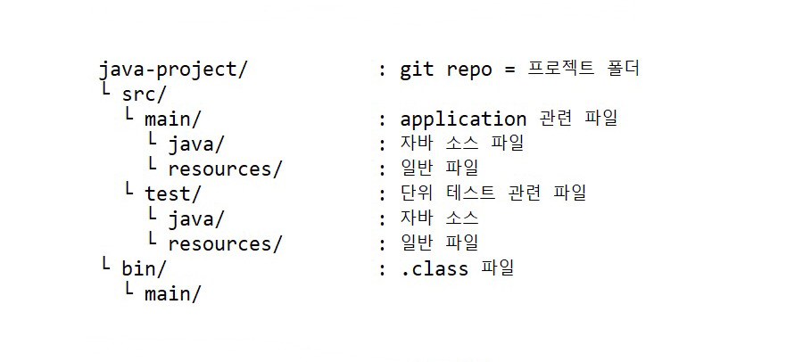
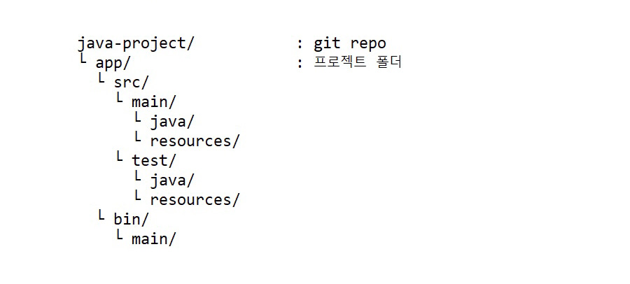

## **1. 애플리케이션과 프로젝트**
1.
<br>
작은 크기의 애플리케이션은 하나의 프로젝트로 관리<br>

2.
<br>
큰 크기의 애플리케이션은 여러 개의 프로젝트로 관리<br>
프로젝트 사이에 의존 관계가 있을 수 있음<br>
>프로젝트: 관리 단위

<br>

## **2. 자바 애플리케이션과 프로젝트**
1. 1단계<br>
git repository = 프로젝트 폴더<br>
(/java-project)

<br>

2. 2단계: .java(소스) 파일과 비트코드가 들어 있는 .class 파일을 분리<br>
<br>
>컴파일: ```java-project>javac -encoding utf-8 -d bin src/Hello.java```<br>
실행: ```java-project>java -cp bin Hello```

<br>

3. 3단계: 애플리케이션의 기능이 복잡해지고 규모가 커짐<br>
-> 프로그래밍 소스 외에 다른 파일들도 필요<br>
>Maven(build 도구) 프로젝트<br>

<br>

>컴파일: ```java-project>javac -encoding utf-8 src/main/java/Hello.java```<br>
실행: ```java-project>java -cp bin/main Hello```

<br>

4. 4단계: 애플리케이션의 규모가 커지면 하나의 프로젝트로 관리하기 힘듦<br>
-> 하나의 저장소에 여러 개의 프로젝트를 둘 수 있도록 구조를 변경<br>

